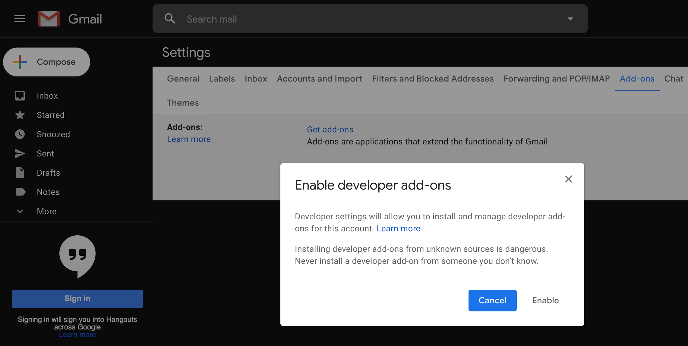
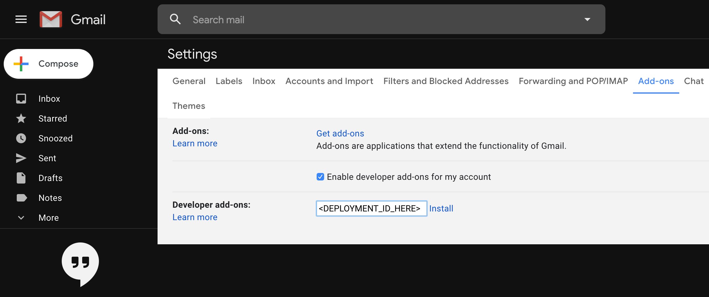
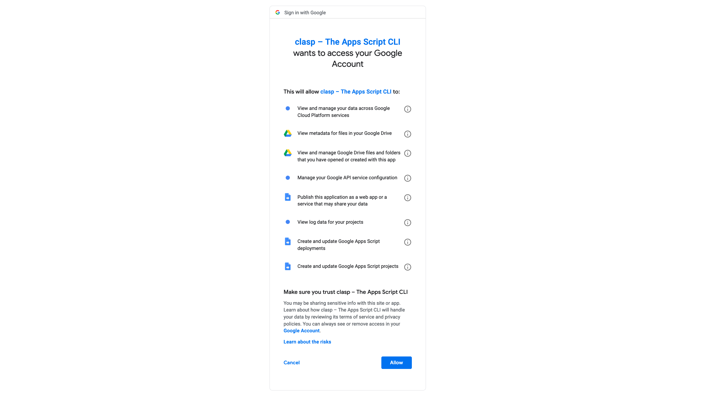
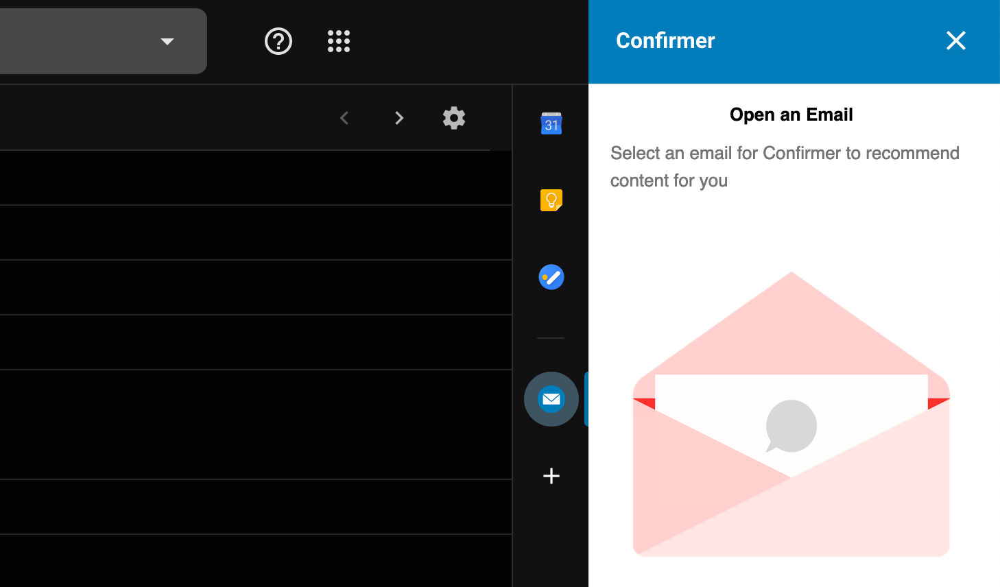
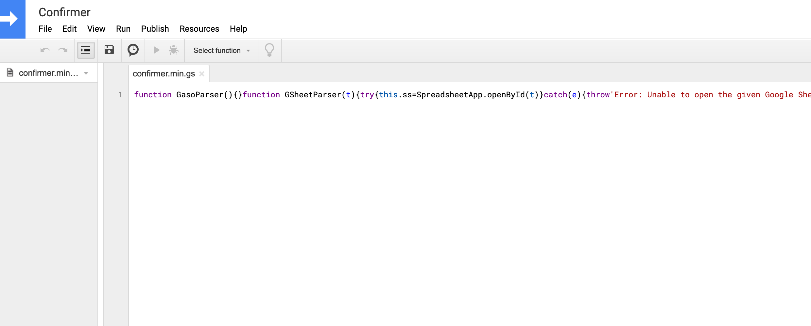
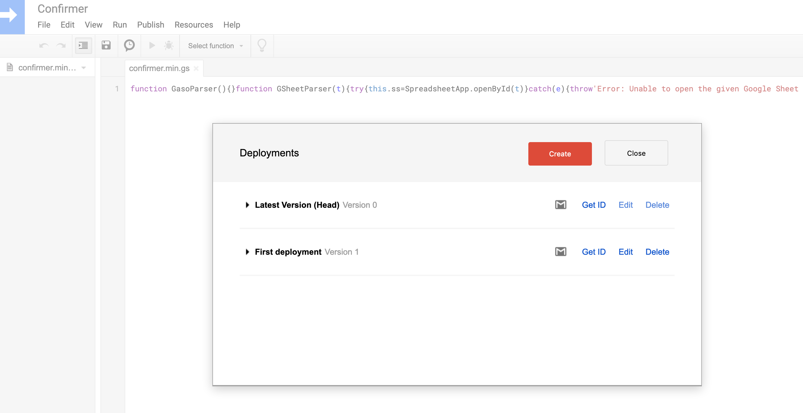

# Confirmer

A Gmail add-on that manages recurring confirmation emails. Pulls information
from Google Sheets (e.g. schedules, contact info, email content).

### Contents
[Requirements](#requirements)

[For End-Users](#for-end---users)
- [Install Current Stable 
  Version](#install-current-stable-version)
- [Install from Github](#install-from-github)
- [How to Use Confirmer?](#how-to-use-confirmer)

[For Developers](#for-developers)
- [Install Build](#install-build)
- [Planned Features](#planned-features)

[Common Questions](#common-issues)


## Requirements
- Google Account

The following requirements are only necessary for developers and for end-users 
who prefer [installing from Github](#install-from-github). If you are 
installing the [current stable version](#install-current-stable-version), you 
may safely ignore the following.

- `git`
- [`npm`](https://www.npmjs.com/get-npm)


## For End-Users
### Install Current Stable Version
0. __Copy the following deployment ID: // TODO.__
    - Note: The deployment ID only works for boston.gov accounts.
1. __Login to your [Gmail account](https://mail.google.com)__.
2. __Click on the gear icon on the upper right of the Gmail window and 
   click on "Settings".__

   

3. __Click on the "Add-ons" tab and select the checkbox labeled "Enable
   developer add-ons for my account".__

   

4. __Click on "Enable" on the bottom-right of the prompted dialogue__.
   
   

5. __Paste the copied deployment ID into the input field labeled "Developer
   add-ons:" and click on "Install".__

   

### Install from Github
0. __Open a command-line shell (Linux / Mac OSX: Terminal. Windows: 
   Powershell).__

    - Install `git` if it is not installed. The tutorial can be found
      [here](https://git-scm.com/book/en/v2/Getting-Started-Installing-Git).
    - Install `npm` if it is not installed The tutorial can be found
      [here](https://www.npmjs.com/get-npm).

1. __Set up your add-on's environment with the following commands:__

```bash
foo@bar:~$ git init
foo@bar:~$ git clone https://github.com/KeiferC/Confirmer.git
foo@bar:~$ cd Confirmer
foo@bar:~$ ./scripts/config
```
  - When prompted on your shell, type your computer password and press the
    enter / return key. The installation requires admin privileges to install
    UglifyJS and `clasp`.

    ```bash
    # For example
    foo@bar:~$ ./script/config
    password: # Enter password here
    ```

  - Google will open a web browser and will ask you to login to your Google
    Account in order to allow `clasp` to access your account. Click "allow" 
    when prompted.

    

   - When prompted by `clasp` on your shell, select `standalone` and press
     the enter / return key.

     ```bash
     # For example
     ...

     Authorization successful.

     Default credentials saved to: ~/.clasprc.json
     ? Create which script? (Use arrow keys)
     > standalone
     docs
     slides
     forms
     webapp
     api
     ```

2. __Run the following command to build and upload the add-on to your Google 
   Account:__

```bash
foo@bar:~$ ./script/build
```

  - When prompted by `clasp` on your shell, type `y` and press the enter / 
    return key.

    ```bash
    # For example
    ? Manifest file has been updated. Do you want to push and overwrite? (y/N) y
    ``` 

3. __Deploy your add-on with the following command:__

```bash
foo@bar:~$ clasp deploy --description "First deployment"
```

4. __Copy the ID returned from running the command in Step 3.__

```bash
# For example
foo@bar:~$ clasp deploy --description "First deployment"
Created version 1.
- <ID_TO_COPY> @1. # e.g. - LG2HY_8vlxARfEDlSIOK6 @1.
                   # Copy: LG2HY_8vlxARfEDlSIOK6
```

5. __Continue at [Step 1 of "Install Current Stable 
   Version"](#install-current-stable-version).__

### How to Use Confirmer?
0. __Click on the Confirmer add-on's icon in the side panel on the right.__

   

1. __Open an email message. Click "AUTHORIZE ACCESS" when prompted by the 
   add-on.__

   


## For Developers
### Build Installation
```bash
# To install
foo@bar:~$ git init
foo@bar:~$ git clone https://github.com/KeiferC/Confirmer.git
foo@bar:~$ cd Confirmer

# To set up development environment on Google Apps Script
foo@bar~$ ./scripts/develop

# To deploy add-on
foo@bar:~$ ./scripts/build
foo@bar:~$ clasp deploy --description "<MESSAGE>" 
           # <MESSAGE>: Version description

# To test, follow instructions from Step 1 of "Install
```

### Planned Features
Feel free to contribute. __Please prioritize security and accessibility.__ 
Below is a list of planned features to implement:

- Change structure to create multiple confirmer based on universal actions. 
  Allows users to set up multiple Confirmer cards.
  - Need to set up unique IDs for each Confirmer card.
  - Need to set up settings card to activate (push onto stack) when a 
    "settings" button in a status card is clicked.
- Add a setting that allows for the user to *choose* to set up a single date 
  with a consistent confirmation email schedule (e.g. every day, every week, 
  every month, etc.), instead of using a Google Sheet containing a flexible 
  schedule.
- Add feature that allows users to select the number of days prior to the 
  event in which they would like the reminder email to be sent.
- Add a setting that allows users to specify a threshold number of scheduled 
  participants required to avoid sending a warning message to self.
- Add a setting that allows the user to mute warning messages.
- Implement suggested searches for column labels (a trie data structure?)
- Add a setting where users manually set their timezone
  - JS' `Date` object relies on the client's timezone. Google's add-on API sets 
    Google as the client. Note: userTimezone.id — the user's timezone 
    identifier (e.g. America/New_York).

The following planned features are currently on indefinite hold until certain
features of the Google API are implemented:

- Initialize settings on install. Currently not possible due to limitations on
  `appscript.json` triggers.
- Trigger add-on build on add-on icon click. Currently not possible due to
  limitations on `appscript.json` triggers.
- Improve add-on's aesthetic design. Currently not possible due to styling
  limitations of the Google CardService API.

## Common Questions
__What do the add-on's requested permissions mean?__

TODO

__What data is collected?__

TODO

__How is the collected data used?__

TODO

__How is the collected data shared?__

TODO

__If I don't copy the add-on's deployment ID, where else can I find the ID?__

Log in to [Google Script](https://script.google.com/). Click on "My Projects"
on the left sidebar. 


Click on "Confirmer", which should lead you to the following page.


Click on "Open Project" on the right sidebar, which should lead you to the
following page.



Click on "Publish", then click on "Deploy from manifest...".


Click on "Get ID" on the right of the Gmail icon for the row labeled 
"__First deployment__ Version 1".



The deployment ID can be found after the label "__Deployment ID:__".


