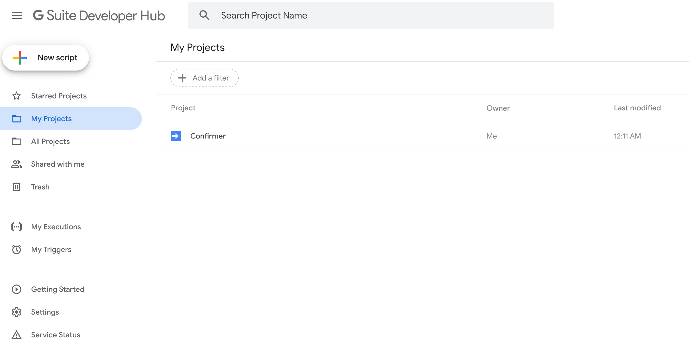

# Confirmer

A Gmail add-on that manages recurring confirmation emails. Pulls information
from Google Sheets (e.g. schedules, contact info, email content).

### Contents
[Requirements](#requirements)

[For End-Users](#for-end---users)
- [Installation of Current Stable 
  Version](#installation-of-current-stable-version)
- [Installation from Github](#installation-from-github)
- [How to Use Confirmer?](#how-to-use-confirmer)

[For Developers](#for-developers)
- [Installation](#installation)
- [Planned Features](#planned-features)


## Requirements
- Google Account

The following requirements are only necessary for developers and for end-users 
who prefer installing from Github. If you are installing the [current stable 
version](#installation-of-current-stable-version), you may safely ignore the 
following.

- `git`
- `sh` / `bash` / `zsh`
- [NPM](https://www.npmjs.com/get-npm): `npm install n -g`
- [UglifyJS2](https://github.com/mishoo/UglifyJS2): `npm install uglify-js -g`
- [Google Clasp](https://github.com/google/clasp): `npm i @google/clasp -g`


## For End-Users
### Installation of Current Stable Version
// TODO

### Installation from Github

> Note: This installation tutorial assumes a fundamental understanding of working
>       with the command-line (e.g. an understanding of directory traversals).

0. Open a command-line shell (Linux / Mac OSX: Terminal. Windows: Powershell).
    - Install `git` if it is not installed. The tutorial can be found
      [here](https://git-scm.com/book/en/v2/Getting-Started-Installing-Git).
    - Install NPM if it is not installed The tutorial can be found
      [here](https://www.npmjs.com/get-npm).
    - Install UglifyJS2 if it is not installed. The tutorial can be found 
      [here](https://github.com/mishoo/UglifyJS2).
    - Install clasp if it is not installed. The tutorial can be found 
      [here](https://github.com/google/clasp).

1. Run the following commands:
```bash
foo@bar:~$ git init
foo@bar:~$ git clone https://github.com/KeiferC/Confirmer.git
foo@bar:~$ cd Confirmer
foo@bar:~$ ./scripts/build
```

2. Google will open a web browser and will ask you to login to your Google
   Account in order to allow `clasp` to access your account. Select "allow" 
   when prompted.

   

5. Select `standalone` on your shell when prompted by clasp.
```bash
? Create which script? (Use arrow keys)
> standalone
  docs
  slides
  forms
  webapp
  api
```
6. Deploy your add-on with the following command:
```bash
foo@bar:~$ clasp deploy --versionNumber 1 --description "First deployment"
```
7. Log in to [Google Script](https://script.google.com/). Click on "My
   Projects" on the left sidebar. 



8. Click on "Confirmer", which should lead you to the following page.


9. Click on "Open Project" on the right sidebar, which should lead you to the
   following page.


10. Click on "Publish", then click on "Deploy from manifest...".


11. Click on the red "Create" button.


12. 

### How to Use Confirmer?
// TODO


## For Developers
### Build Installation
```bash
# To install
foo@bar:~$ git init
foo@bar:~$ git clone https://github.com/KeiferC/Confirmer.git
foo@bar:~$ cd Confirmer

# To set up development environment on Google Apps Script
foo@bar~$ ./scripts/develop

# To deploy add-on
foo@bar:~$ ./scripts/build
foo@bar:~$ clasp deploy --versionNumber <N> --description "<MESSAGE>" 
           # <N>:       Version number (> 0)
           # <MESSAGE>: Version description
```

### Planned Features
Feel free to contribute. __Please prioritize security and accessibility.__ 
Below is a list of planned features to implement:

- Change structure to create multiple confirmer based on universal actions. 
  Allows users to set up multiple Confirmer cards.
  - Need to set up unique IDs for each Confirmer card.
  - Need to set up settings card to activate (push onto stack) when a 
    "settings" button in a status card is clicked.
- Add a setting that allows for the user to *choose* to set up a single date 
  with a consistent confirmation email schedule (e.g. every day, every week, 
  every month, etc.), instead of using a Google Sheet containing a flexible 
  schedule.
- Add feature that allows users to select the number of days prior to the 
  event in which they would like the reminder email to be sent.
- Add a setting that allows users to specify a threshold number of scheduled 
  participants required to avoid sending a warning message to self.
- Add a setting that allows the user to mute warning messages.
- Implement suggested searches for column labels (a trie data structure?)
- Add a setting where users manually set their timezone
  - JS' `Date` object relies on the client's timezone. Google's add-on API sets 
    Google as the client. Note: userTimezone.id — the user's timezone 
    identifier (e.g. America/New_York).

The following planned features are currently on indefinite hold until certain
features of the Google API are implemented:

- Initialize settings on install. Currently not possible due to limitations on
  `appscript.json` triggers.
- Trigger add-on build on add-on icon click. Currently not possible due to
  limitations on `appscript.json` triggers.
- Improve add-on's aesthetic design. Currently not possible due to styling
  limitations of the Google CardService API.
